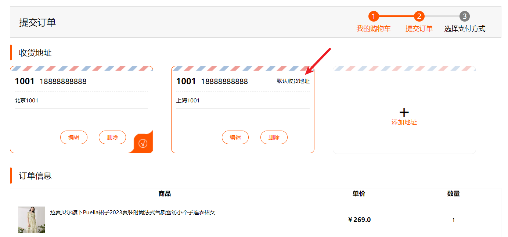
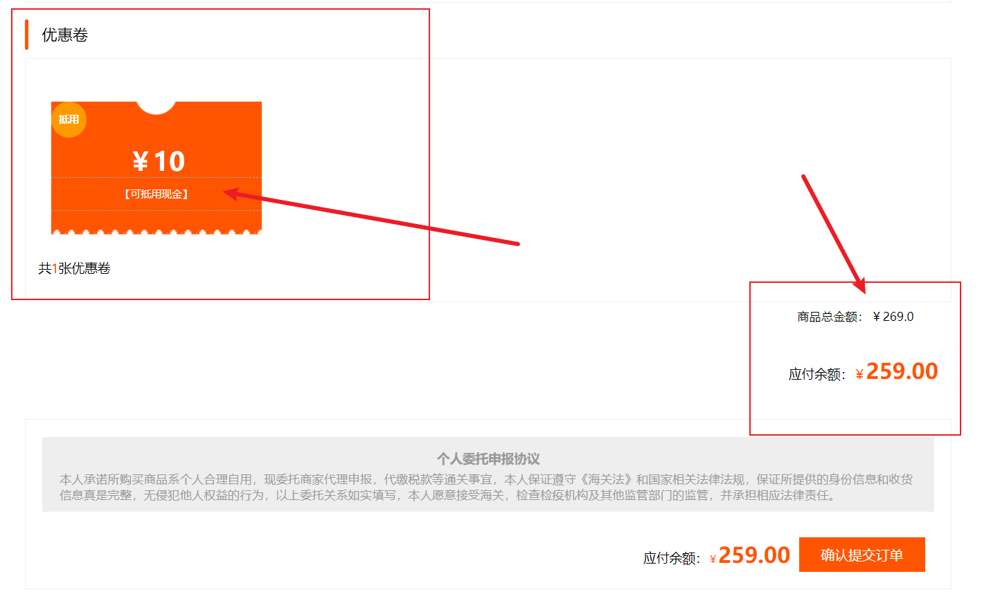
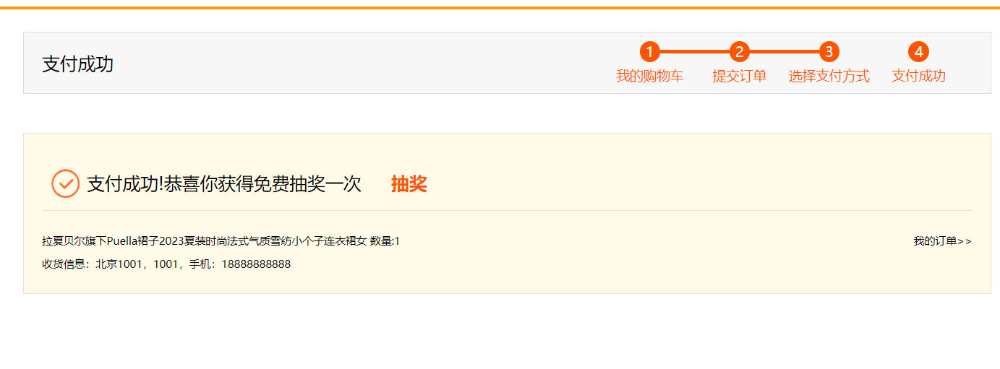
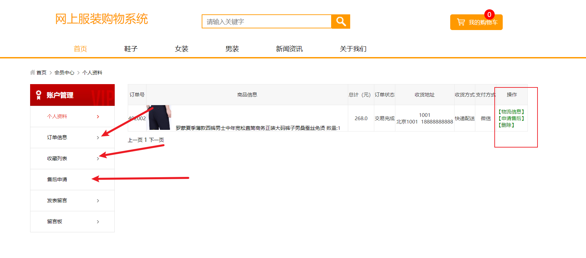
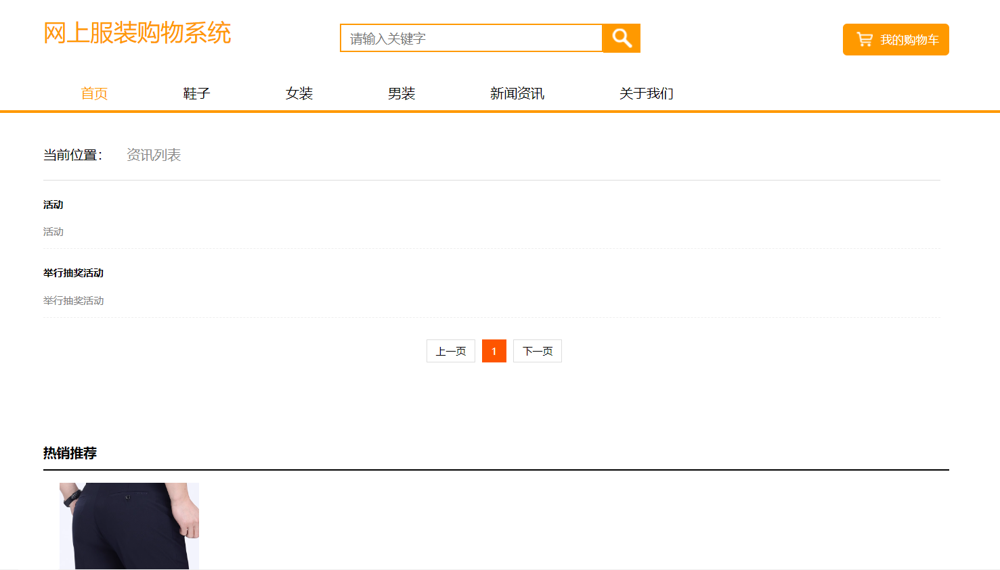
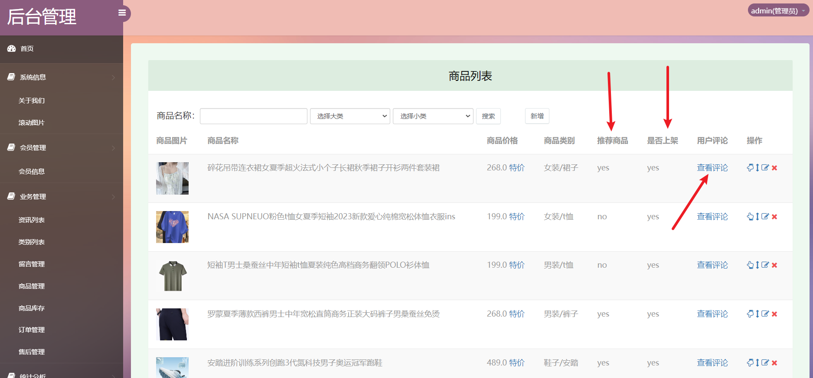
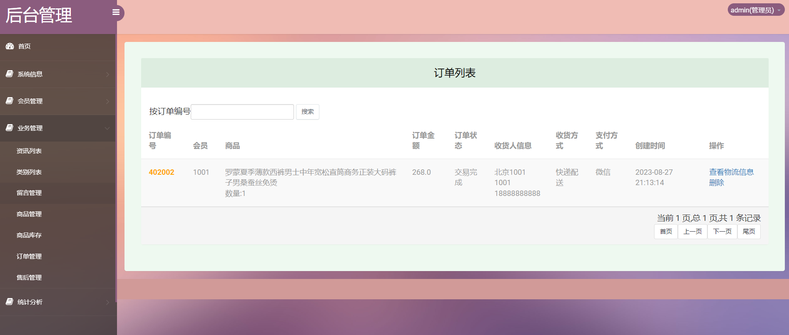
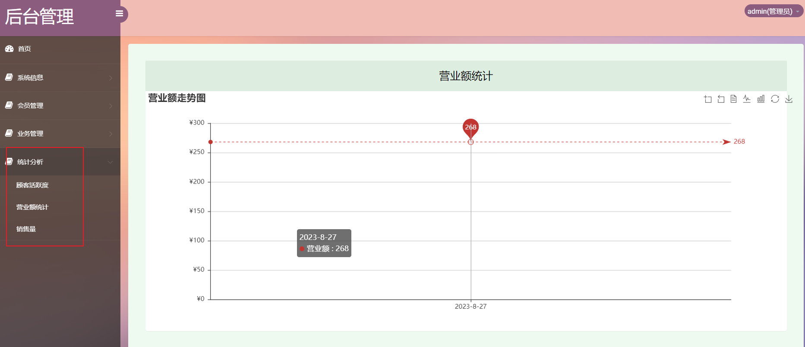

>【**项目特色**】
>
>- **抽奖功能**
>- **优惠劵功能**
>- **物流信息功能**
>- **Q: 3270728362**

## 简介

**基于SSM的服装商城系统**

- 开发语言：Java 
- 数据库：MySQL 
- 技术：Spring、Mybaits、SpringMVC 
- 工具：IDEA/Ecilpse、Navicat、Maven

**前台功能:**
&emsp;&emsp;注册、登录、退出、商品查询、商品列表及详情、商品推荐、购物车、个人中心、订单管理、评价、申请售后、查看物流、地址管理、收藏、优惠劵功能、抽奖功能等。

**后台功能:**
&emsp;&emsp;商品管理、用户管理、订单管理、物流管理、统计分析（可视化）、轮播图管理、个人信息管理、上架下架、推荐功能、关于我们、留言管理等。

## 优惠卷功能

## 抽奖功能

## 物流管理

## 可视化统计

